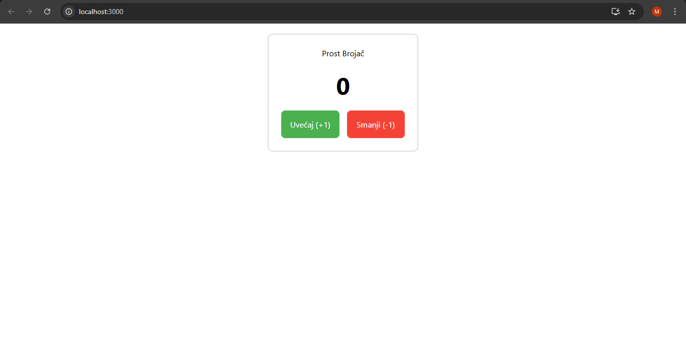

🔢 React Brojač (Counter App)

Ovo je moderna React aplikacija koja služi kao interaktivni brojač. Projekat je kreiran tokom savladavanja React 19 osnova, sa fokusom na upravljanje stanjima i stilizovanje.

📱 Pregled aplikacije

🚀 Tehnologije

- **React 19** - JavaScript biblioteka za izgradnju korisničkih interfejsa.
- **JavaScript (ES6+)** - Logika aplikacije.
- **Tailwind CSS** - Konfigurisan za moderan dizajn i responzivnost.
- **CSS-in-JS** - Korišćen za precizne inline stilove unutar komponenti.

✨ Ključne Funkcionalnosti

- **Uvećavanje (+1)**: Interaktivno dugme zelene boje.
- **Smanjivanje (-1)**: Interaktivno dugme crvene boje.
- **Responzivan dizajn**: UI je centriran i prilagođen svim veličinama ekrana.

📂 Struktura projekta

- `src/MyApp.js` - Glavna komponenta koja povezuje logiku.
- `src/useStateBrojac.js` - Komponenta koja sadrži `useState` hook i logiku brojanja.
- `public/index.html` - HTML šablon sa prilagođenim naslovom "React Brojac".
- `tailwind.config.js` - Konfiguracioni fajl za Tailwind stilove.

🛠️ Instalacija i pokretanje

Da biste pokrenuli ovaj projekat lokalno na svom računaru, pratite ove korake:

1. **Klonirajte repozitorijum:**
 
   git clone [https://github.com/Milannba23/Brojac.git](https://github.com/Milannba23/Brojac.git)

2.Uđite u folder projekta:

	cd Brojac

3.Instalirajte sve potrebne biblioteke:

	npm install

4.Pokrenite aplikaciju:

	npm start

Autor: Milannba23